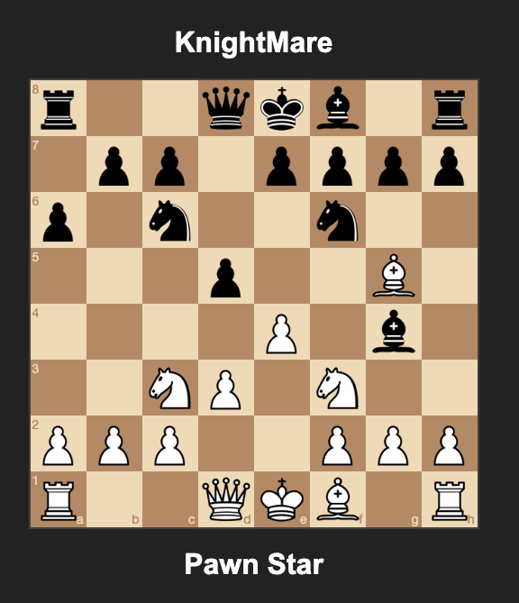

# pyws-chess

A simple online chess game via websockets.

Live Demo:

[https://chess.olzhasar.com](https://chess.olzhasar.com)



## Technologies

- [asyncio](https://docs.python.org/3/library/asyncio.html)
- [FastAPI](https://fastapi.tiangolo.com/) for the server
- [msgspec](https://github.com/jcrist/msgspec) for message serialization
- [WebSockets](https://developer.mozilla.org/en-US/docs/Web/API/WebSockets_API) for real-time communication
- [python-chess](https://python-chess.readthedocs.io/en/latest/) for server-side chess logic
- [chessboard.js](https://chessboardjs.com/) for client rendering
- [chess.js](https://github.com/jhlywa/chess.js) for client-side chess logic
- [Prometheus](https://prometheus.io/) and [prometheus-fastapi-instrumentator](https://github.com/trallnag/prometheus-fastapi-instrumentator)  for metrics

## Features
- Real-time chess game
- Client and server-side move validation
- Automatic matchmaking

### Limitations
- Reconnection is not supported

## Running locally

### Docker

```bash
docker build -t pyws-chess .
docker run -p 8000:8000 pyws-chess
```

### Local installation

#### Pre-requisites

- [uv](https://github.com/astral-sh/uv)
- Python 3.11+

```bash
cd src
uv run uvicorn app.main:app
```

The server will be running on `http://localhost:8000`.

## License

MIT
